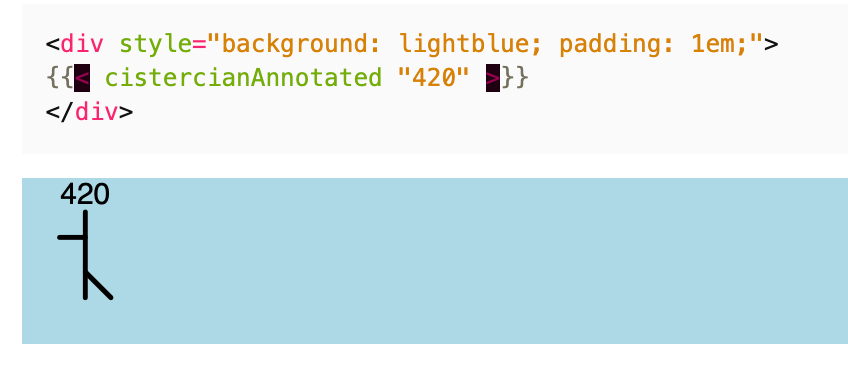

# hugo-theme-cistercian

A small utility theme for displaying Cistercian numerals in Hugo.

Here's a screenshot of how it is used in your site content:



See live examples at <https://me.micahrl.com/blog/hugo-theme-cistercian>.

## How to use it

### 1. Clone the theme into `themes/cistercian` in your site repo.

```sh
git submodule add https://github.com/mrled/hugo-themes-cistercian themes/cistercian
```

### 2. Add the theme to your theme list.

If your site config is YAML:

```yaml
theme:
- cistercian
- your-theme-here
```

Or if it's TOML:

```toml
theme = ["cistercian", "your-theme-here"]
```

### 3. Add the theme's head partial to the `<head>` element

You can do this site-wide if you like, or just for the `<head>` of any page which will display Cistercian numerals. (Typically you'll need to do this in your site's theme somehow.)

```go-html-template
<head>
...
  {{ partial "cistercian.head.html" . }}
</head>
```

### 4. Use the theme's partials in your page content

Now you can use the partials defined in the theme in your page content.

```go-html-template
You can show annotated numerals:



Or unannotated ones:



And there is special support for supporting (annotated) YYYY MMDD HHMM datetimestamps:



You can control annotations with an included checkbox:


```
